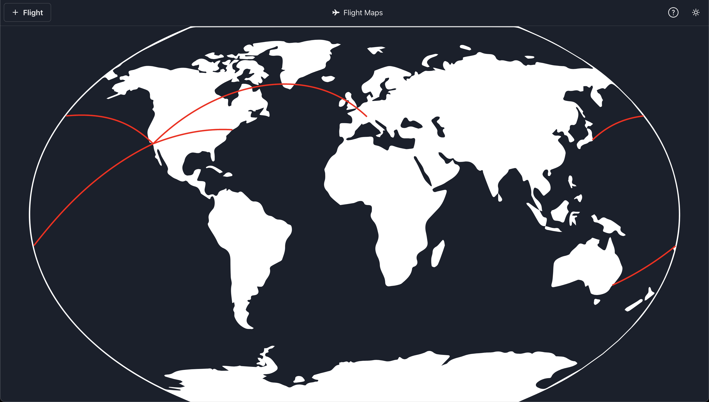
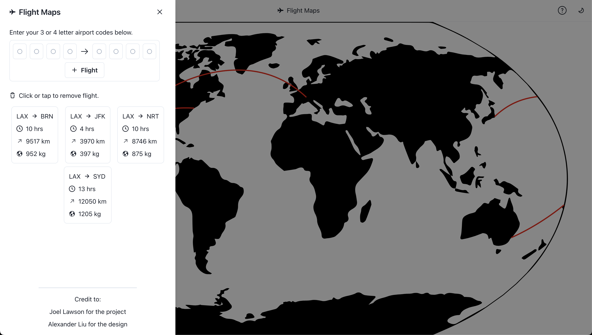

# FlightMaps (Frontend)

FlightMaps is a React-based web application that displays your flight paths on an interactive map. Simply enter the airports you've flown from and to, and the app will render the trajectory along with estimates for flight time, distance, and CO₂ emissions. The flight trajectories are computed using great circle calculations and are rendered on a Kravraiskiy VII map projection for precise and visually engaging representations.

2025-09-24: FlightMaps has been moved to NextJS

---

## Features

- **Interactive Map:** View dynamic flight trajectories on an easy-to-use map interface.
- **Flight Data Estimates:** Get estimates of flight duration, distance covered, and CO₂ emissions.
- **User-Friendly Input:** Enter origin and destination airports with a clean, intuitive form.

## Technologies Used

- **React.js:** For building a modern, component-driven user interface.
- **ChakraUI:** Utilized ChakraUI for the modular and stylized components.
- **FastAPI:** Developed a backend with FastAPI to calculate and return coordinates for accurate trajectories

